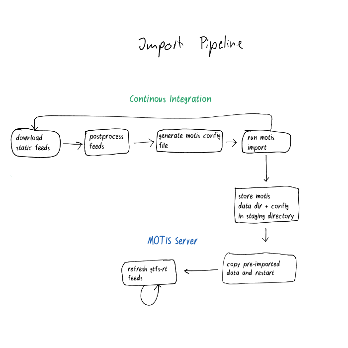

<!--
SPDX-FileCopyrightText: None
SPDX-License-Identifier: CC0-1.0
-->

# Transitous

Free and open public transport routing.

## Goal

A community-run provider-neutral international public transport routing service.

Using openly available GTFS/GTFS-RT/GBFS/etc. feeds and FOSS routing engine we want to operate a
routing service that:

* focuses on the interest of the user rather than the public transport operators
* is free to use
* values user privacy
* does not stop at borders
* aims at crowd-sourced maintenance of data feeds in the spirit of FOSS

## Contact

For general discussions about data availability: [#opentransport:matrix.org](https://matrix.to/#/#opentransport:matrix.org)

For Transitous-specific technical topics: [#transitous:matrix.spline.de](https://matrix.to/#/#transitous:matrix.spline.de)

## Adding a region

Transitous data sources are divided by region, so they can be continuously tested and verified by locals.

All the data from a specific region is stored in a region file,
located in the [feeds](https://github.com/public-transport/transitous/tree/main/feeds) directory.
This region file is a `json` file, which is named after the unique country
[ISO_3166-1](https://en.wikipedia.org/wiki/ISO_3166-1) code or the unique principal subdivision
[ISO_3166-2](https://en.wikipedia.org/wiki/ISO_3166-2) code (for example for US states).

A region file has a `maintainers` attribute, which contains a list of people responsible for keeping the feeds for the region up to date.

```json
{
    "maintainers": [ ... ],
    "sources": [ ... ]
}
```

A person is represented like this:

```json
{
    "name": "< name of the maintainer >",
    "github": "< github username of the maintainer >"
}
```

The main attribute of a region is `sources`. It contains a list of feeds that should be fetched.

### Static feeds (timetable)

Each source can either be of `type` `mobility-database`, `transitland-atlas` or `http`.
Feeds from the [Mobility Database](https://mobilitydatabase.org/) can be referenced by the number in the URL on the website.
Feeds from [Transitland](https://www.transit.land/feeds) (a different database of feeds), can be referenced by their Onestop ID.

Mobility Database:
```json
{
    "name": "<name to be used for the output filename, should not contain spaces>",
    "type": "mobility-database",
    "mdb-id": <number>
}
```

Transitland:
```json
{
    "name": "<name to be used for the output filename, should not contain spaces>",
    "type": "transitland-atlas",
    "transitland-atlas-id": "<onestop id>"
}
```

If the feed is not part of any existing database, a http source can be used instead.

```json
{
    "name": "<name to be used for the output filename>",
    "type": "http",
    "url": "https://<url of GTFS file>",
    "license": {
        "spdx-identifier": "<license identifier from https://spdx.org/licenses/ if known>",
        "url": "< url as source for the license if available >"
    }
}
```

In both cases, the name needs to be unique in the file.
If the feed contains invalid entries, you can try to add the `"fix": true` attribute, to try to automatically correct errors.

### Realtime feeds

GTFS-RT feeds contain updates for a GTFS feed.
In order to know which feed to apply the updates to, their name must match the name of the static timetable.

This example applies the updates to the `lviv` feed:
```
[
    {
        "name": "lviv",
        "type": "http",
        "url": "https://track.ua-gis.com/gtfs/lviv/static.zip",
    },
    {
        "name": "lviv",
        "spec": "gtfs-rt",
        "type": "url",
        "url": "https://track.ua-gis.com/gtfs/lviv/trip_updates"
    }
]
```

### Shared Mobility feeds

GBFS feeds contains realtime information like vehicle availability and characteristics for shared Mobility (e.g. Bikesharing).
Each source can only be of `type` `transitland-atlas`.

Feeds from [Transitland](https://www.transit.land/feeds) can be referenced by their Onestop ID.

GBFS Database:
```json
{
    "name": "<name of the feed>",
    "type": "transitland-atlas",
    "transitland-atlas-id": "<onestop id>"
}
```

The name needs to be unique in the file.

### Testing

Once you create a pull request, fetching your feed will automatically be tested.

You can also test it locally. For that, first get an up to date copy of transitland-atlas:

```bash
git submodule update --remote --checkout --init
```

You also need to have [gtfsclean](https://github.com/public-transport/gtfsclean) installed.
We provide a static build for linux so you don't need to build your own.

```
wget -P ~/.local/bin https://github.com/public-transport/gtfsclean/releases/download/snapshot-4/gtfsclean
chmod +x ~/.local/bin/gtfsclean
```

You can also use the container described below.

Then you can fetch individual regions using

```bash
./src/fetch.py feeds/<region>.json
```

### More source options

There are all kinds of options that may be specified in a source:

Option Name         | Description
------------------- | ------------------------------------------------------------------------------------------------------------------------------------
`type`              | `http`, `mobility-database`, `transitland-atlas` or `url`. Url sources are not downloaded, but passed to MOTIS as URL. This is used for realtime feeds.
`spec`              | `gtfs` or `gtfs-rt`. `gtfs-rt` may only be used when `type` is `url`.
`fix`               | Fix / drop fields that are not correct.
`skip`              | Don't download or use this feed.
`skip-reason`       | Reason for why this feed can't be used right now.
`fix-csv-quotes`    | Try to fix GTFS files in which fields are improperly quoted. A symptom of this is if stop names start containing CSV.
`license`           | Dictionary of license-related options
`http-options`      | Dictionary of HTTP-related options
`drop-shapes`       | Remove route shapes, use if the shapes are mostly wrong
`drop-agency-names` | Removes a list of agencies. Can be used to avoid duplicates if the agency provides its own feed.

#### License Options

Option Name       | Description
----------------- | --------------------------------------------------
`spdx-identifier` | License identifier from <https://spdx.org/licenses/>
`url`             | Website that states the License of the data

#### HTTP Options

Option Name           | Description
--------------------- | -----------------------------------------------------------------------------------------------------------------------------
`headers`             | Dictionary of custom HTTP headers to send when checking for updates / downloading.
`ignore-tls-errors`   | Ignore expired / invalid TLS certificate
`fetch-interval-days` | Fetch this feed at most every `n` days. Useful if a server doesn't send `Last-Modified`, or to comply with terms of service.

### Common Patterns

You can use `http-options` even with `transitland-atlas-id`.
This is useful for passing in things like headers with API keys.

```json
{
    "name": "Example-Feed",
    "type": "transitland-atlas",
    "transitland-atlas-id": "example-feed-id",
    "http-options": {
        "headers": {
            "api-key": "key"
        }
    }
}
```

## Overview of the import pipeline
The following pipeline runs on a daily basis to import new GTFS feed data.
This image gives an overview of the steps executed in the data pipeline:



## Running a transitous instance locally

Running a local instance of the transitous setup can be useful for debugging.
The easiest way is to use the same container image that we use for fetching and importing the data on the CI.

First, ensure that you have the Git submodules:

```bash
git submodule update --remote --checkout --init
```

Proceed by building the container:

```bash
podman build ci/container/ -t transitous -f ci/container/Containerfile
```

Enter the container:

```bash
podman run -it -p 8080:8080 -v $PWD:/transitous:Z --userns=keep-id -w /transitous transitous
```

Now inside the container, you can download and post-process the feeds you want.

```bash
./src/fetch.py feeds/<region>.json
```

If you want to download all of them instead, you can use `mkdir -p out && cd out && wget --mirror -l 1 --no-parent --no-directories --accept gtfs.zip -e robots=off https://api.transitous.org/gtfs/` to download the postprocessed files from the Transitous server, or `./ci/fetch-feeds.py timer` to process them yourself. However, importing all feeds will take about half an hour even on powerful hardware.

The `out/` directory should now contain a number of zip files.

In addition to those, you also need a background map. Importing the entire planet would take too long,
so for now, use a smaller region.
You can find working map pbf downloads at [Geofabrik](https://download.geofabrik.de/).
You can click on the region names to find downloads for smaller subregions.

Then download the chosen region:

```bash
wget https://download.geofabrik.de/europe/germany/berlin-latest.osm.pbf -P out
```

In order to start motis, we need a config file listing all the feeds we want to use.
You can generate one using our script:

```bash
./src/generate-motis-config.py full
```

The generated config file still needs a small adjustment.
Edit the line in `out/config.yml` that starts with `osm:` to point to your map, and remove the `coastline` option in `tiles`.

If you did not download all feeds, you also need to remove every feed that you did not download.
Thanks to the region code prefix, the part you want to keep should be easy to find.

You can then go to the `out` directory, import everything and start motis:

```bash
cd out
motis import
motis server
```

Once it's done, the motis web interface should be reachable on [localhost:8080](http://localhost:8080).


